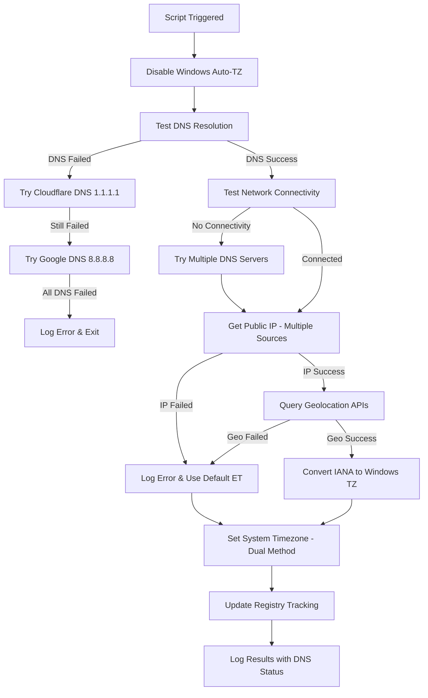

# Automatic Timezone Configuration for Windows

A PowerShell solution that automatically detects and configures the correct timezone on Windows computers based on their public IP address geolocation. Perfect for organizations with mobile users, remote workers, or devices that travel between time zones. **Enhanced version 1.7.0 with robust DNS resolution and Windows automatic timezone conflict prevention.**

## 🌍 Overview

This script automatically:
- **Disables Windows built-in automatic timezone detection** to prevent conflicts
- **Enhanced DNS resolution** with Cloudflare (1.1.1.1, 1.0.0.1) and Google DNS (8.8.8.8, 8.8.4.4) fallback
- Detects your public IP address using multiple reliable sources
- Geolocates the IP to determine timezone with multiple API providers
- Converts IANA timezone identifiers to Windows timezone format
- Sets the system timezone appropriately with dual-method fallback
- **Network connectivity testing** with DNS resolution verification
- Logs all activities for troubleshooting with enhanced detail
- **Windows PowerShell 5.1 compatibility** for legacy systems

## ✨ Features

- **🔧 Conflict Prevention**: Automatically disables Windows location-based timezone detection
- **🌐 Enhanced DNS Resolution**: Direct resolution using Cloudflare (1.1.1.1, 1.0.0.1) and Google DNS (8.8.8.8, 8.8.4.4)
- **🔗 Network Connectivity Testing**: Verifies connectivity with DNS fallback before API calls
- **📡 Multiple IP Detection Sources**: 6 different IP detection services for reliability
- **🗺️ Multiple Geolocation APIs**: 3 different geolocation providers (ip-api.com, ipapi.co, geoplugin.net)
- **⚡ Smart Network Monitoring**: Runs on startup, logon, and network profile changes
- **🗺️ Comprehensive Timezone Mapping**: Supports 50+ major timezones worldwide with IANA conversion
- **⏰ Scheduled Task Integration**: XML-based task definition with multiple triggers
- **🏢 Enterprise Ready**: Designed for deployment via Microsoft Intune or other MDM solutions
- **📊 Enhanced Registry Tracking**: Stores comprehensive metadata and tracking information
- **📝 Detailed Logging**: Tracks all timezone changes with timestamps and version info
- **🛡️ Robust Error Handling**: Multiple fallback methods for DNS, IP detection, and timezone setting
- **👻 No User Interaction**: Runs silently in the background as SYSTEM
- **🔄 Windows PowerShell 5.1 Compatible**: Works on legacy Windows systems

## 🚨 Problem Solved

**Common Issue**: Windows devices incorrectly detecting timezones (e.g., showing "Africa" instead of "Eastern Time") due to:
- Rogue access points providing inaccurate geolocation data
- Flawed Windows built-in geolocation services
- Inconsistent location services
- DNS resolution failures preventing accurate IP geolocation
- Network connectivity issues blocking timezone detection

**Our Solution**: This script **disables Windows automatic timezone detection** and replaces it with:
- **Reliable IP-based geolocation** with multiple API sources
- **Enhanced DNS resolution** using Cloudflare and Google DNS servers
- **Network connectivity verification** before attempting API calls
- **Multiple fallback methods** for every critical operation
- **Comprehensive error handling** ensuring timezone detection works regardless of network conditions

## 🚀 Quick Start

### Option 1: One-Click Setup (Recommended)

Run this single command as Administrator to set up everything:

```powershell
# Download and run the complete setup script
Invoke-Expression (Invoke-WebRequest -Uri "https://raw.githubusercontent.com/ghostinator/SysAdminPSSorcery/refs/heads/main/Windows/TimeZoneAuto-Configuration/TimezoneAuto-Configuration.ps1" -UseBasicParsing).Content
```

### Option 2: Manual Installation

1. **Download the setup script**:
   ```powershell
   Invoke-WebRequest -Uri "https://raw.githubusercontent.com/ghostinator/SysAdminPSSorcery/refs/heads/main/Windows/TimeZoneAuto-Configuration/TimezoneAuto-Configuration.ps1"
   ```

2. **Run as Administrator**:
   ```powershell
   .\Setup-AutoTimezone.ps1
   ```

## 📁 What Gets Installed

The setup script creates:
- `C:\Scripts\UpdateTimezone.ps1` - The main timezone detection script (Enhanced v1.7.0 with DNS resolution)
- `C:\Scripts\TimezoneUpdate.log` - Activity log file with enhanced tracking and DNS resolution details
- Scheduled Task: "AutoTimezoneUpdate" - Runs on startup, logon, and network profile changes
- Registry entries: `HKLM:\SOFTWARE\AutoTimezone` - Comprehensive tracking data including DNS resolution status
- **System Changes**: Disables Windows automatic timezone services and location-based detection

## 🔧 System Modifications

### **Windows Services Disabled**
- **tzautoupdate service**: Windows automatic timezone detection disabled
- **Location-based timezone**: Registry settings modified to prevent conflicts
- **Geolocation services**: Location-based timezone detection disabled

### **Registry Tracking Enhanced (v1.7.0)**
The script now stores comprehensive tracking information in `HKLM:\SOFTWARE\AutoTimezone`:
- `LastIANATimezoneDetected` - IANA timezone identifier detected from geolocation
- `LastWindowsTimezoneSet` - Windows timezone ID that was applied to the system
- `LastGeolocationInfo` - Complete geographic location string with IP and location details
- `LastUpdateStatus` - Status message from the last timezone update attempt
- `LastUpdateTime` - ISO timestamp of last script execution
- `ScriptVersionRun` - Version tracking for updates and compatibility

## 🏢 Enterprise Deployment

### Microsoft Intune

1. Navigate to **Devices > Scripts and remediations > Platform scripts**
2. Click **Add > Windows 10 and later**
3. Upload the `Setup-AutoTimezone.ps1` script
4. Configure:
   - **Run this script using the logged on credentials**: No
   - **Enforce script signature check**: No
   - **Run script in 64-bit PowerShell**: Yes
5. Assign to device groups

### Group Policy

Deploy via Computer Configuration > Policies > Windows Settings > Scripts > Startup

### Other RMM Tools

The script can be deployed through any RMM platform that supports PowerShell script execution with SYSTEM privileges.

## 🌐 Supported Timezones

The script includes comprehensive mapping for major timezones including:

| Region | Supported Timezones |
|--------|-------------------|
| **North America** | Eastern, Central, Mountain, Pacific, Alaska, Hawaii |
| **Europe** | GMT, CET, EET, and all major European zones |
| **Asia** | Tokyo, Shanghai, Singapore, India, Dubai, and more |
| **Australia** | All Australian timezone variants |
| **Others** | South America, Africa, New Zealand |

## 📊 How It Works (v1.7.0 Enhanced)



## 🔧 Configuration

### Triggers (Enhanced v1.7.0)

The script runs automatically when:
- Computer starts up (Boot Trigger)
- User logs in (Logon Trigger)  
- Network profile changes detected (Event Trigger - NetworkProfile Event 10000)
- Manual execution via Task Scheduler

### Enhanced DNS Resolution & Connectivity

The v1.7.0 enhancement includes:
- **Primary DNS**: System DNS resolution attempt first
- **Cloudflare DNS**: 1.1.1.1 (primary) and 1.0.0.1 (secondary) fallback
- **Google DNS**: 8.8.8.8 (primary) and 8.8.4.4 (secondary) fallback  
- **OpenDNS**: 208.67.222.222 and 208.67.220.220 additional fallback
- **Network Testing**: Connectivity verification before API calls
- **Multiple Methods**: Test-NetConnection, Test-Connection, and .NET ping fallbacks

### Customization (v1.7.0)

Edit `C:\Scripts\UpdateTimezone.ps1` to customize:
- **DNS Servers**: Modify the `$DNSServers` array to add/remove DNS providers
- **IP Detection APIs**: Update `$ipServices` array with additional IP detection sources
- **Geolocation APIs**: Modify `$geoServices` array to add more geolocation providers
- **Timezone Mapping**: Extend the IANA to Windows timezone mapping table
- **Connectivity Timeouts**: Adjust timeout values for network tests
- **Logging Verbosity**: Control detail level of DNS resolution and connectivity logging

## 📝 Enhanced Logging (v1.7.0)

All activities are logged to `C:\Scripts\TimezoneUpdate.log` with enhanced DNS resolution detail:

```
[2025-01-15 10:20:15] (1.7.0-Enhanced-DNS-PS51) Script execution started.
[2025-01-15 10:20:15] Attempting DNS resolution for: api.ipify.org
[2025-01-15 10:20:15]   ✓ Resolved via system DNS: 104.16.132.229
[2025-01-15 10:20:16]   ✓ Network connectivity confirmed to api.ipify.org (104.16.132.229)
[2025-01-15 10:20:16]   ✓ Public IP Address: 203.0.113.45 (from https://api.ipify.org/)
[2025-01-15 10:20:17] Testing connectivity to ip-api.com for geolocation...
[2025-01-15 10:20:17]   ✓ Resolved via Cloudflare DNS 1.1.1.1: 208.95.112.1
[2025-01-15 10:20:18]   ✓ Location Details (from ip-api.com):
[2025-01-15 10:20:18]     City: New York, Region: New York, Country: United States
[2025-01-15 10:20:18]     IANA Timezone: America/New_York
[2025-01-15 10:20:18]   Found explicit mapping for IANA 'America/New_York': 'Eastern Standard Time'
[2025-01-15 10:20:19]   Successfully set timezone to 'Eastern Standard Time'
[2025-01-15 10:20:19] (1.7.0-Enhanced-DNS-PS51) Script execution finished. Status: Successfully set timezone to 'Eastern Standard Time'. (IP: 203.0.113.45, City: New York, Region: New York, Country: United States, IANA TZ: America/New_York)
```

## 🛠️ Troubleshooting

### Common Issues (v1.7.0)

**Script doesn't run automatically**
- Verify scheduled task exists: `Get-ScheduledTask -TaskName "AutoTimezoneUpdate"`
- Check task is enabled and configured to run as SYSTEM- Verify triggers include Boot, Logon, and NetworkProfile events
**Timezone not detected correctly**
- Check internet connectivity and DNS resolution
- Verify multiple geolocation APIs are accessible
- Review log file for DNS resolution failures
- Test manual DNS resolution: `nslookup api.ipify.org 1.1.1.1`

**DNS resolution failures**
- Check if corporate firewall blocks DNS queries to external servers
- Verify Cloudflare (1.1.1.1) and Google (8.8.8.8) DNS are accessible
- Review DNS resolution logs in the script output
- Consider adding internal DNS servers to the fallback list

**Network connectivity issues**
- Verify outbound HTTPS (443) and HTTP (80) access
- Check if proxy settings affect script execution
- Review connectivity test results in log file
- Test manual connectivity: `Test-NetConnection api.ipify.org -Port 80`

**Windows automatic timezone re-enables**
- Check if Windows Updates reset the settings
- Verify registry modifications are persistent
- Re-run the setup script to re-disable automatic features- Monitor tzautoupdate service status
**Permission errors**
- Ensure script runs with administrative privileges
- Verify SYSTEM account has necessary permissions- Check if antivirus software blocks script execution
### Enhanced Verification

Check Windows automatic timezone status:
```powershell
# Verify Windows automatic timezone is disabled
Get-ItemProperty -Path "HKLM:\SYSTEM\CurrentControlSet\Services\tzautoupdate" -Name "Start"
### Enhanced Verification (v1.7.0)4 (disabled)

# Check registry tracking
Get-ItemProperty -Path "HKLM:\SOFTWARE\AutoTimezone"
```Get-Service -Name "tzautoupdate" | Select-Object Name, Status, StartType

# Test DNS resolution manually
nslookup api.ipify.org 1.1.1.1
nslookup ip-api.com 8.8.8.8

# Check network connectivity to geolocation services
Test-NetConnection api.ipify.org -Port 80
Test-NetConnection ip-api.com -Port 80

# Verify scheduled task configuration
Get-ScheduledTask -TaskName "AutoTimezoneUpdate" | Select-Object TaskName, State
(Get-ScheduledTask -TaskName "AutoTimezoneUpdate").Triggers

# Check registry tracking information
Get-ItemProperty -Path "HKLM:\SOFTWARE\AutoTimezone" -ErrorAction SilentlyContinue

# Test script execution manually
Start-ScheduledTask -TaskName "AutoTimezoneUpdate"

# Monitor real-time log output
Get-Content "C:\Scripts\TimezoneUpdate.log" -Tail 20 -Wait
```

### DNS Resolution Testing

Test the enhanced DNS resolution functionality:
```powershell
# Test Cloudflare DNS resolution
nslookup api.ipify.org 1.1.1.1
nslookup api.ipify.org 1.0.0.1

# Test Google DNS resolution  
nslookup api.ipify.org 8.8.8.8
nslookup api.ipify.org 8.8.4.4

# Test OpenDNS resolution
nslookup api.ipify.org 208.67.222.222
nslookup api.ipify.org 208.67.220.220
```
### Manual Testing

Test the enhanced script manually:
```powershell
# Run the timezone script directly
C:\Scripts\UpdateTimezone.ps1

# Check current timezone
Get-TimeZone

# View enhanced registry tracking
Get-ItemProperty -Path "HKLM:\SOFTWARE\AutoTimezone"

# View recent log entries
Get-Content C:\Scripts\TimezoneUpdate.log -Tail 10
```

## 🔒 Security Considerations

- Script runs with SYSTEM privileges (required for timezone and registry changes)
- Uses HTTPS endpoints for IP detection
- No sensitive data is stored or transmitted
- All operations are logged for audit purposes
- **System modifications are tracked** in registry for transparency
- Network change detection uses local registry storage only
- **Windows service modifications** are logged and reversible

## ⚠️ Important Notes

### **System Changes**
This enhanced version makes the following system modifications:
- **Disables Windows automatic timezone service** (`tzautoupdate`)
- **Modifies location services registry** settings
- **Takes control of timezone management** from Windows

### **Reverting Changes**
To restore Windows automatic timezone functionality:
```powershell
# Re-enable Windows automatic timezone
Set-ItemProperty -Path "HKLM:\SYSTEM\CurrentControlSet\Services\tzautoupdate" -Name "Start" -Value 3

# Re-enable location services (if desired)
Set-ItemProperty -Path "HKLM:\SOFTWARE\Microsoft\Windows\CurrentVersion\CapabilityAccessManager\ConsentStore\location" -Name "Value" -Value "Allow"
```

## 🤝 Contributing

Contributions are welcome! Please feel free to submit:
- Additional timezone mappings
- Support for new geolocation APIs
- Enhanced conflict detection
- Documentation improvements

### Development Setup

1. Fork the repository
2. Create a feature branch
3. Test on multiple Windows versions
4. Verify Windows service interactions
5. Submit a pull request

## 🚀 What's New in v1.7.0 - Enhanced DNS Resolution

The latest version includes significant enhancements for network reliability and DNS resolution:

### 🌐 Enhanced DNS Resolution
- **Cloudflare DNS Integration**: Primary fallback to 1.1.1.1 and 1.0.0.1 for reliable DNS resolution
- **Google DNS Support**: Secondary fallback to 8.8.8.8 and 8.8.4.4 for maximum compatibility
- **OpenDNS Fallback**: Additional fallback to 208.67.222.222 and 208.67.220.220
- **System DNS First**: Always attempts system DNS resolution before fallbacks

### 🔗 Network Connectivity Enhancements
- **Pre-API Connectivity Testing**: Verifies network connectivity before attempting API calls
- **Multiple Testing Methods**: Uses Test-NetConnection, Test-Connection, and .NET ping
- **DNS-Resolved Connectivity**: Tests connectivity to resolved IP addresses, not just hostnames
- **Timeout Management**: Configurable timeouts for all network operations

### 📡 Multiple Service Providers
- **6 IP Detection Services**: api.ipify.org, ipinfo.io, icanhazip.com, checkip.amazonaws.com, ip4.seeip.org, myexternalip.com
- **3 Geolocation APIs**: ip-api.com, ipapi.co, geoplugin.net with different response format handling
- **Automatic Failover**: Seamlessly switches between providers if one fails

### 🛡️ Enhanced Error Handling
- **Graceful Degradation**: Falls back to Eastern Time if all geolocation attempts fail
- **Comprehensive Logging**: Detailed DNS resolution and connectivity status in logs
- **Windows PowerShell 5.1 Compatible**: Full backward compatibility with legacy systems

### ⚡ Improved Triggers
- **NetworkProfile Event Trigger**: Automatically runs when network profile changes (Event ID 10000)
- **Boot and Logon Triggers**: Maintains existing startup and user logon triggers
- **XML-Based Task Definition**: More reliable scheduled task creation and management

## 📋 Requirements

- **OS**: Windows 10/11 (PowerShell 5.1+)
- **Permissions**: Administrator rights for initial setup and system modifications
- **Network**: Internet connectivity for geolocation APIs
- **Dependencies**: None (uses built-in Windows PowerShell)

## 🆕 Version History

### **v1.7.0 (Enhanced DNS Resolution) **
- ✅ **Enhanced DNS Resolution**: Direct resolution using Cloudflare (1.1.1.1, 1.0.0.1) and Google DNS (8.8.8.8, 8.8.4.4)
- ✅ **Multiple DNS Fallbacks**: OpenDNS (208.67.222.222, 208.67.220.220) additional fallback servers
- ✅ **Network Connectivity Testing**: Verifies connectivity with DNS resolution before API calls
- ✅ **Multiple IP Detection Sources**: 6 different IP detection services for maximum reliability
- ✅ **Multiple Geolocation APIs**: 3 different providers (ip-api.com, ipapi.co, geoplugin.net)
- ✅ **Enhanced Network Triggers**: Boot, Logon, and NetworkProfile Event 10000 triggers
- ✅ **Windows PowerShell 5.1 Compatibility**: Full compatibility with legacy Windows systems
- ✅ **Robust Error Handling**: Multiple fallback methods for DNS, connectivity, and timezone setting
- ✅ **Enhanced Logging**: Detailed DNS resolution and connectivity status logging
- ✅ **Dual-Method Timezone Setting**: Set-TimeZone and tzutil.exe fallback methods

### **v1.1 (Enhanced) - Previous**
- ✅ Disables Windows automatic timezone to prevent conflicts
- ✅ Enhanced registry tracking with comprehensive metadata
- ✅ Improved logging with version information
- ✅ Better conflict prevention and system integration
- ✅ Validates Windows service modifications

### **v1.0 (Original)**
- ✅ Basic IP-based timezone detection
- ✅ Network change monitoring
- ✅ Scheduled task automation

## 📄 License

This project is licensed under the MIT License - see the [LICENSE](LICENSE) file for details.

## 🙏 Acknowledgments

- [ipify.org](https://www.ipify.org/) for free IP detection API
- [ip-api.com](http://ip-api.com/) for geolocation services
- Microsoft PowerShell team for excellent timezone cmdlets
- Windows administration community for feedback on conflict prevention

## 📞 Support

- **Issues**: [GitHub Issues](https://github.com/ghostinator/SysAdminPSSorcery/issues)


---

⭐ **Star this repository if it helped you solve timezone conflicts!** ⭐

**Made with ❤️ for the Windows administration community**
