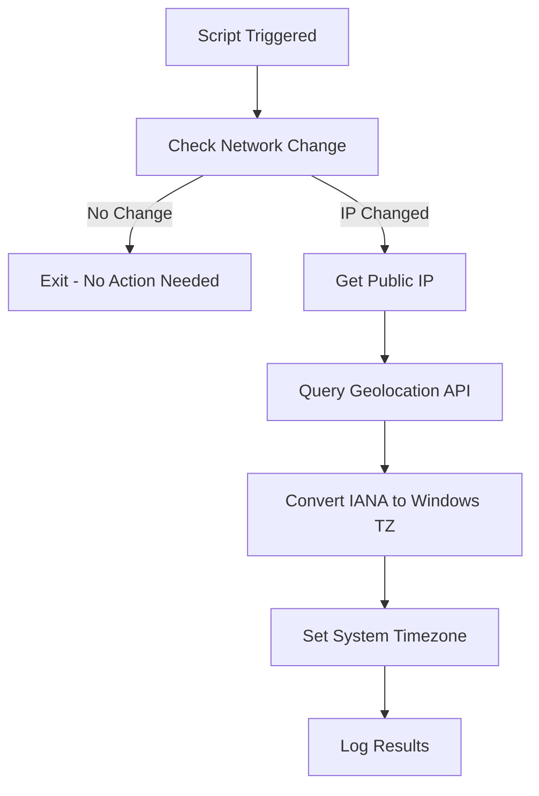

# Automatic Timezone Configuration for Windows

A PowerShell solution that automatically detects and configures the correct timezone on Windows computers based on their public IP address geolocation. Perfect for organizations with mobile users, remote workers, or devices that travel between time zones.

## 🌍 Overview

This script automatically:
- Detects your public IP address
- Geolocates the IP to determine timezone
- Converts IANA timezone identifiers to Windows timezone format
- Sets the system timezone appropriately
- Only updates when network changes are detected (efficiency)
- Logs all activities for troubleshooting

## ✨ Features

- **Automatic Detection**: Uses IP geolocation to determine correct timezone
- **Network Change Monitoring**: Only runs when IP address changes (saves resources)
- **Comprehensive Timezone Mapping**: Supports 30+ major timezones worldwide
- **Scheduled Task Integration**: Runs automatically on startup and user logon
- **Enterprise Ready**: Designed for deployment via Microsoft Intune or other MDM solutions
- **Detailed Logging**: Tracks all timezone changes with timestamps
- **Error Handling**: Robust error handling with fallback options
- **No User Interaction**: Runs silently in the background

## 🚀 Quick Start

### Option 1: One-Click Setup (Recommended)

Run this single command as Administrator to set up everything:

```powershell
# Download and run the complete setup script
Invoke-Expression (Invoke-WebRequest -Uri "https://raw.githubusercontent.com/ghostinator/SysAdminPSSorcery/refs/heads/main/Windows/TimeZoneAuto-Configuration/TimezoneAuto-Configuration.ps1" -UseBasicParsing).Content
```

### Option 2: Manual Installation

1. **Download the setup script**:
   ```powershell
   Invoke-WebRequest -Uri "https://raw.githubusercontent.com/ghostinator/SysAdminPSSorcery/refs/heads/main/Windows/TimeZoneAuto-Configuration/TimezoneAuto-Configuration.ps1"
   ```

2. **Run as Administrator**:
   ```powershell
   .\Setup-AutoTimezone.ps1
   ```

## 📁 What Gets Installed

The setup script creates:
- `C:\Scripts\UpdateTimezone.ps1` - The main timezone detection script
- `C:\Scripts\TimezoneUpdate.log` - Activity log file
- Scheduled Task: "AutoTimezoneUpdate" - Runs on startup and logon
- Registry entries for tracking network changes

## 🏢 Enterprise Deployment

### Microsoft Intune

1. Navigate to **Devices > Scripts and remediations > Platform scripts**
2. Click **Add > Windows 10 and later**
3. Upload the `TimezoneAuto-Configuration.ps1` script
4. Configure:
   - **Run this script using the logged on credentials**: No
   - **Enforce script signature check**: No
   - **Run script in 64-bit PowerShell**: Yes
5. Assign to device groups

### Group Policy

Deploy via Computer Configuration > Policies > Windows Settings > Scripts > Startup

### Other RMM Tools

The script can be deployed through any RMM platform that supports PowerShell script execution with SYSTEM privileges.

## 🌐 Supported Timezones

The script includes comprehensive mapping for major timezones including:

| Region | Supported Timezones |
|--------|-------------------|
| **North America** | Eastern, Central, Mountain, Pacific, Alaska, Hawaii |
| **Europe** | GMT, CET, EET, and all major European zones |
| **Asia** | Tokyo, Shanghai, Singapore, India, Dubai, and more |
| **Australia** | All Australian timezone variants |
| **Others** | South America, Africa, New Zealand |

## 📊 How It Works



## 🔧 Configuration

### Triggers

The script runs automatically when:
- Computer starts up
- User logs in
- Network connection changes (detected via IP change)

### Customization

Edit `C:\Scripts\UpdateTimezone.ps1` to customize:
- API endpoints for IP detection
- Timezone mapping table
- Logging verbosity
- Error handling behavior

## 📝 Logging

All activities are logged to `C:\Scripts\TimezoneUpdate.log`:

```
[2025-05-23 10:20:15] Timezone update script started
[2025-05-23 10:20:16] Network change detected: 192.168.1.100 -> 203.0.113.45
[2025-05-23 10:20:18] Successfully updated timezone to Eastern Standard Time (Location: New York, United States)
```

## 🛠️ Troubleshooting

### Common Issues

**Script doesn't run automatically**
- Verify scheduled task exists: `Get-ScheduledTask -TaskName "AutoTimezoneUpdate"`
- Check task is enabled and configured to run as SYSTEM

**Timezone not detected correctly**
- Check internet connectivity
- Verify geolocation API is accessible
- Review log file for specific errors

**Permission errors**
- Ensure script runs with administrative privileges
- Verify SYSTEM account has necessary permissions

### Manual Testing

Test the script manually:
```powershell
# Run the timezone script directly
C:\Scripts\UpdateTimezone.ps1

# Check current timezone
Get-TimeZone

# View recent log entries
Get-Content C:\Scripts\TimezoneUpdate.log -Tail 10
```

## 🔒 Security Considerations

- Script runs with SYSTEM privileges (required for timezone changes)
- Uses HTTPS endpoints for IP detection
- No sensitive data is stored or transmitted
- All operations are logged for audit purposes
- Network change detection uses local registry storage only

## 🤝 Contributing

Contributions are welcome! Please feel free to submit:
- Additional timezone mappings
- Support for new geolocation APIs
- Enhanced error handling
- Documentation improvements

### Development Setup

1. Fork the repository
2. Create a feature branch
3. Test on multiple Windows versions
4. Submit a pull request

## 📋 Requirements

- **OS**: Windows 10/11 (PowerShell 5.1+)
- **Permissions**: Administrator rights for initial setup
- **Network**: Internet connectivity for geolocation APIs
- **Dependencies**: None (uses built-in Windows PowerShell)

## 📄 License

This project is licensed under the MIT License - see the [LICENSE](LICENSE) file for details.

## 🙏 Acknowledgments

- [ipify.org](https://www.ipify.org/) for free IP detection API
- [ip-api.com](http://ip-api.com/) for geolocation services
- Microsoft PowerShell team for excellent timezone cmdlets

## 📞 Support

- **Issues**: [GitHub Issues](https://github.com/ghostinator/SysAdminPSSorcery/issues)

---

⭐ **Star this repository if it helped you!** ⭐

*Made with ❤️ for the Windows administration community*
