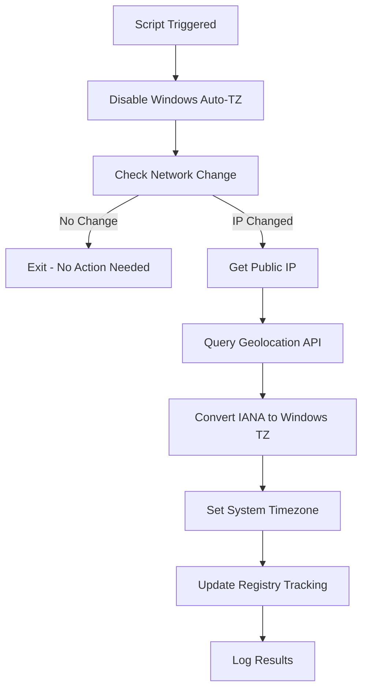

# Automatic Timezone Configuration for Windows

A PowerShell solution that automatically detects and configures the correct timezone on Windows computers based on their public IP address geolocation. Perfect for organizations with mobile users, remote workers, or devices that travel between time zones. **Enhanced version that disables Windows automatic timezone features to prevent conflicts.**

## 🌍 Overview

This script automatically:
- **Disables Windows built-in automatic timezone detection** to prevent conflicts
- Detects your public IP address
- Geolocates the IP to determine timezone
- Converts IANA timezone identifiers to Windows timezone format
- Sets the system timezone appropriately
- Only updates when network changes are detected (efficiency)
- Logs all activities for troubleshooting

## ✨ Features

- **🔧 Conflict Prevention**: Automatically disables Windows location-based timezone detection
- **🌐 Automatic Detection**: Uses IP geolocation to determine correct timezone
- **⚡ Network Change Monitoring**: Only runs when IP address changes (saves resources)
- **🗺️ Comprehensive Timezone Mapping**: Supports 30+ major timezones worldwide
- **⏰ Scheduled Task Integration**: Runs automatically on startup and user logon
- **🏢 Enterprise Ready**: Designed for deployment via Microsoft Intune or other MDM solutions
- **📊 Enhanced Registry Tracking**: Stores comprehensive metadata and tracking information
- **📝 Detailed Logging**: Tracks all timezone changes with timestamps and version info
- **🛡️ Error Handling**: Robust error handling with fallback options
- **👻 No User Interaction**: Runs silently in the background

## 🚨 Problem Solved

**Common Issue**: Windows devices incorrectly detecting timezones (e.g., showing "Africa" instead of "Eastern Time") due to:
- Rogue access points providing inaccurate geolocation data
- Flawed Windows built-in geolocation services
- Inconsistent location services

**Our Solution**: This script **disables Windows automatic timezone detection** and replaces it with reliable IP-based geolocation, ensuring accurate timezone detection regardless of local network conditions.

## 🚀 Quick Start

### Option 1: One-Click Setup (Recommended)

Run this single command as Administrator to set up everything:

```powershell
# Download and run the complete setup script
Invoke-Expression (Invoke-WebRequest -Uri "https://raw.githubusercontent.com/ghostinator/SysAdminPSSorcery/refs/heads/main/Windows/TimeZoneAuto-Configuration/TimezoneAuto-Configuration.ps1" -UseBasicParsing).Content
```

### Option 2: Manual Installation

1. **Download the setup script**:
   ```powershell
   Invoke-WebRequest -Uri "https://raw.githubusercontent.com/ghostinator/SysAdminPSSorcery/refs/heads/main/Windows/TimeZoneAuto-Configuration/TimezoneAuto-Configuration.ps1"
   ```

2. **Run as Administrator**:
   ```powershell
   .\Setup-AutoTimezone.ps1
   ```

## 📁 What Gets Installed

The setup script creates:
- `C:\Scripts\UpdateTimezone.ps1` - The main timezone detection script (Enhanced v1.1)
- `C:\Scripts\TimezoneUpdate.log` - Activity log file with enhanced tracking
- Scheduled Task: "AutoTimezoneUpdate" - Runs on startup and logon
- Registry entries: `HKLM:\SOFTWARE\AutoTimezone` - Comprehensive tracking data
- **System Changes**: Disables Windows automatic timezone services

## 🔧 System Modifications

### **Windows Services Disabled**
- **tzautoupdate service**: Windows automatic timezone detection disabled
- **Location-based timezone**: Registry settings modified to prevent conflicts
- **Geolocation services**: Location-based timezone detection disabled

### **Registry Tracking Enhanced**
The script now stores comprehensive tracking information in `HKLM:\SOFTWARE\AutoTimezone`:
- `LastPublicIP` - Last detected public IP address
- `LastTimezoneUpdate` - Timestamp of last timezone change
- `LastDetectedTimezone` - IANA timezone identifier detected
- `LastWindowsTimezone` - Windows timezone ID applied
- `LastLocation` - Geographic location string
- `ScriptVersion` - Version tracking for updates
- `WindowsAutoTimezoneDisabled` - Confirmation flag

## 🏢 Enterprise Deployment

### Microsoft Intune

1. Navigate to **Devices > Scripts and remediations > Platform scripts**
2. Click **Add > Windows 10 and later**
3. Upload the `Setup-AutoTimezone.ps1` script
4. Configure:
   - **Run this script using the logged on credentials**: No
   - **Enforce script signature check**: No
   - **Run script in 64-bit PowerShell**: Yes
5. Assign to device groups

### Group Policy

Deploy via Computer Configuration > Policies > Windows Settings > Scripts > Startup

### Other RMM Tools

The script can be deployed through any RMM platform that supports PowerShell script execution with SYSTEM privileges.

## 🌐 Supported Timezones

The script includes comprehensive mapping for major timezones including:

| Region | Supported Timezones |
|--------|-------------------|
| **North America** | Eastern, Central, Mountain, Pacific, Alaska, Hawaii |
| **Europe** | GMT, CET, EET, and all major European zones |
| **Asia** | Tokyo, Shanghai, Singapore, India, Dubai, and more |
| **Australia** | All Australian timezone variants |
| **Others** | South America, Africa, New Zealand |

## 📊 How It Works



## 🔧 Configuration

### Triggers

The script runs automatically when:
- Computer starts up
- User logs in
- Network connection changes (detected via IP change)

### Enhanced Tracking

The enhanced version now tracks:
- **Network changes**: IP address monitoring
- **Timezone history**: Previous timezone settings
- **Location data**: Geographic information from IP
- **System modifications**: Windows service status
- **Script execution**: Detailed logging with timestamps

### Customization

Edit `C:\Scripts\UpdateTimezone.ps1` to customize:
- API endpoints for IP detection
- Timezone mapping table
- Logging verbosity
- Registry tracking details
- Windows service modification behavior

## 📝 Enhanced Logging

All activities are logged to `C:\Scripts\TimezoneUpdate.log` with enhanced detail:

```
[2025-05-23 10:20:15] Timezone update script started (Enhanced v1.1)
[2025-05-23 10:20:15] Successfully disabled Windows automatic timezone
[2025-05-23 10:20:16] Network change detected: 192.168.1.100 -> 203.0.113.45
[2025-05-23 10:20:18] Successfully updated timezone to Eastern Standard Time (Location: New York, NY, United States)
[2025-05-23 10:20:18] Updated registry tracking information
```

## 🛠️ Troubleshooting

### Common Issues

**Script doesn't run automatically**
- Verify scheduled task exists: `Get-ScheduledTask -TaskName "AutoTimezoneUpdate"`
- Check task is enabled and configured to run as SYSTEM

**Timezone not detected correctly**
- Check internet connectivity
- Verify geolocation API is accessible
- Review log file for specific errors

**Windows automatic timezone re-enables**
- Check if Windows Updates reset the settings
- Verify registry modifications are persistent
- Re-run the setup script to re-disable automatic features

**Permission errors**
- Ensure script runs with administrative privileges
- Verify SYSTEM account has necessary permissions

### Enhanced Verification

Check Windows automatic timezone status:
```powershell
# Verify Windows automatic timezone is disabled
Get-ItemProperty -Path "HKLM:\SYSTEM\CurrentControlSet\Services\tzautoupdate" -Name "Start"
# Should return: Start = 4 (disabled)

# Check registry tracking
Get-ItemProperty -Path "HKLM:\SOFTWARE\AutoTimezone"
```

### Manual Testing

Test the enhanced script manually:
```powershell
# Run the timezone script directly
C:\Scripts\UpdateTimezone.ps1

# Check current timezone
Get-TimeZone

# View enhanced registry tracking
Get-ItemProperty -Path "HKLM:\SOFTWARE\AutoTimezone"

# View recent log entries
Get-Content C:\Scripts\TimezoneUpdate.log -Tail 10
```

## 🔒 Security Considerations

- Script runs with SYSTEM privileges (required for timezone and registry changes)
- Uses HTTPS endpoints for IP detection
- No sensitive data is stored or transmitted
- All operations are logged for audit purposes
- **System modifications are tracked** in registry for transparency
- Network change detection uses local registry storage only
- **Windows service modifications** are logged and reversible

## ⚠️ Important Notes

### **System Changes**
This enhanced version makes the following system modifications:
- **Disables Windows automatic timezone service** (`tzautoupdate`)
- **Modifies location services registry** settings
- **Takes control of timezone management** from Windows

### **Reverting Changes**
To restore Windows automatic timezone functionality:
```powershell
# Re-enable Windows automatic timezone
Set-ItemProperty -Path "HKLM:\SYSTEM\CurrentControlSet\Services\tzautoupdate" -Name "Start" -Value 3

# Re-enable location services (if desired)
Set-ItemProperty -Path "HKLM:\SOFTWARE\Microsoft\Windows\CurrentVersion\CapabilityAccessManager\ConsentStore\location" -Name "Value" -Value "Allow"
```

## 🤝 Contributing

Contributions are welcome! Please feel free to submit:
- Additional timezone mappings
- Support for new geolocation APIs
- Enhanced conflict detection
- Documentation improvements

### Development Setup

1. Fork the repository
2. Create a feature branch
3. Test on multiple Windows versions
4. Verify Windows service interactions
5. Submit a pull request

## 📋 Requirements

- **OS**: Windows 10/11 (PowerShell 5.1+)
- **Permissions**: Administrator rights for initial setup and system modifications
- **Network**: Internet connectivity for geolocation APIs
- **Dependencies**: None (uses built-in Windows PowerShell)

## 🆕 Version History

### **v1.1 (Enhanced) - Current**
- ✅ Disables Windows automatic timezone to prevent conflicts
- ✅ Enhanced registry tracking with comprehensive metadata
- ✅ Improved logging with version information
- ✅ Better conflict prevention and system integration
- ✅ Validates Windows service modifications

### **v1.0 (Original)**
- ✅ Basic IP-based timezone detection
- ✅ Network change monitoring
- ✅ Scheduled task automation

## 📄 License

This project is licensed under the MIT License - see the [LICENSE](LICENSE) file for details.

## 🙏 Acknowledgments

- [ipify.org](https://www.ipify.org/) for free IP detection API
- [ip-api.com](http://ip-api.com/) for geolocation services
- Microsoft PowerShell team for excellent timezone cmdlets
- Windows administration community for feedback on conflict prevention

## 📞 Support

- **Issues**: [GitHub Issues](https://github.com/ghostinator/SysAdminPSSorcery/issues)


---

⭐ **Star this repository if it helped you solve timezone conflicts!** ⭐

*Made with ❤️ for the Windows administration community*